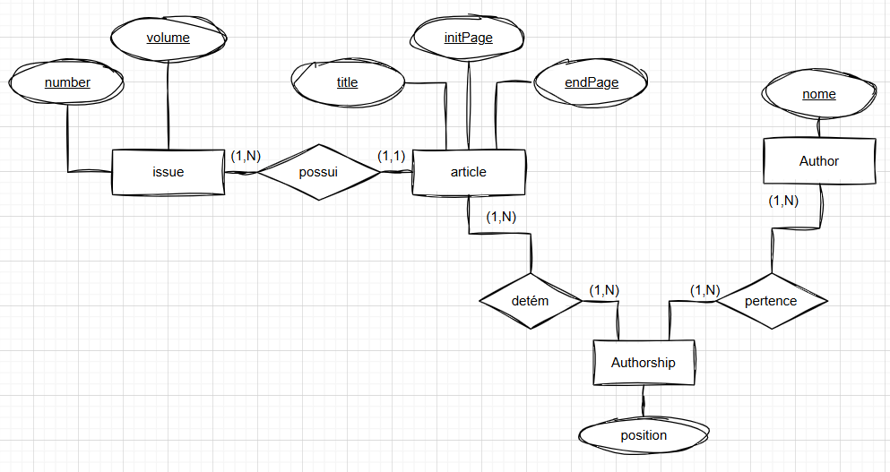

# TP2-TADB

**Descrição:**

Este projeto tem como objetivo a prática de mapeamento de dados XML para relacional.

Considerando o documento SIGMOD Record disponível no XML Data Repository da Universidade de Washington
 
(http://www.cs.washington.edu/research/xmldatasets/)

a) proponha 10 consutas XPath que explorem diferentes eixos de caminhamento e as execute utilizando algum processador de consultas XML. Seja criativo e proponha consultas que permitam o uso de diferentes construções da linguagem.

b) crie um banco de dados relacional que modele esse seu documento XML e popule-o com os registros XML.

c) apresente as 10 consultas propostas no item ‘a’ em SQL
 
**Entregas:**
 
1- 10 (dez) Consultas XPath
 
2- Modelo Conceitual do Banco de Dados
 
3- Modelo Lógico Relacional do Banco de Dados
 
4- Funções de mapeamento (povoamento) do Banco de Dados
 
5- Consultas SQL equivalentes à XPath proposta no item 1

---

## 1. Consultas XPath

1. Busca todos os artigos.
```xpath
/sigmodrecord/issue/articles
```

2. descrição
```xpath
código
```

3. descrição
```xpath
código
```

## 2. Modelo Conceitual do Banco de Dados (MER)



## 3. Modelo Lógico Relacional do Banco de Dados

Modelo lógico em linha

- ISSUE ( <ins>volume</ins> , <ins> number</ins> )

- ARTICLE ( <ins>title</ins> , <ins>volume_issue</ins> , <ins>number_issue</ins> , initPage , endPage )

- AUTHOR ( <ins>name</ins> )

- AUTHORSHIP ( <ins> article_title</ins> , <ins>article_volume</ins> , <ins> article_number</ins> , <ins> author_name</ins> , <ins> position</ins> )

### 3.1 Modelo Físico

```sql
CREATE TABLE Issue (
    volume INTEGER NOT NULL,
    number INTEGER NOT NULL,
    
    CONSTRAINT pk_issue PRIMARY KEY (volume, number),
    CONSTRAINT chk_issue_volume_01 CHECK (volume > 0),
    CONSTRAINT chk_issue_number_01 CHECK (number > 0)
);

CREATE TABLE Article (
    title VARCHAR(500) NOT NULL,
    initPage INTEGER NOT NULL,
    endPage INTEGER NOT NULL,
    volume_issue INTEGER NOT NULL,
    number_issue INTEGER NOT NULL,
    
    CONSTRAINT pk_article PRIMARY KEY (title, volume_issue, number_issue),
    CONSTRAINT fk_article_volume_issue FOREIGN KEY (volume_issue, number_issue) 
        REFERENCES Issue(volume, number),
    CONSTRAINT chk_article_pages_01 CHECK (initPage >= 0 AND endPage >= 0 AND endPage >= initPage)
);

CREATE TABLE Author (
    name VARCHAR(200) NOT NULL,
    
    CONSTRAINT pk_author PRIMARY KEY (name)
);

CREATE TABLE Authorship (
    article_title VARCHAR(500) NOT NULL,
    article_volume INTEGER NOT NULL,
    article_number INTEGER NOT NULL,
    author_name VARCHAR(200) NOT NULL,
    position CHAR(2) NOT NULL,
    
    CONSTRAINT pk_authorship PRIMARY KEY (article_title, article_volume, article_number, author_name),
    CONSTRAINT fk_authorship_article FOREIGN KEY (article_title, article_volume, article_number) 
        REFERENCES Article(title, volume_issue, number_issue),
    CONSTRAINT fk_authorship_author FOREIGN KEY (author_name) 
        REFERENCES Author(name),
    CONSTRAINT chk_authorship_position_01 CHECK (position ~ '^[0-9]{2}$')
);
```

## 4. Funções de mapeamento (povoamento) do Banco de Dados

Povoamento do banco de dados com PYTHON.

**Requisitos**

- Instalação das bibliotecas do **psycopg2** e **xml.etree.ElementTree**

- O arquivo **XML** deve estar mesmo nível do diretório do arquivo executável **PYTHON**.

```python
import xml.etree.ElementTree as ET
import psycopg2

# === CONFIGURAÇÃO DO BANCO ===
connection_params = {
    "dbname": "new-database",
    "user": "root",
    "password": "root",
    "host": "localhost",
    "port": "5432"
}

conn = psycopg2.connect(**connection_params)
cur = conn.cursor()

# === CARREGAR O XML ===
tree = ET.parse("SigmodRecord.xml")
root = tree.getroot()

print(f"📂 Tag raiz: {root.tag}")

# === PERCORRER AS ISSUES ===
for issue in root.findall("issue"):
    volume = issue.findtext("volume")
    number = issue.findtext("number")

    if not volume or not number:
        continue

    volume = int(volume)
    number = int(number)

    print(f"📘 Inserindo Issue: volume={volume}, number={number}")
    cur.execute("""
        INSERT INTO Issue (volume, number)
        VALUES (%s, %s)
        ON CONFLICT DO NOTHING;
    """, (volume, number))

    # === PERCORRER ARTIGOS ===
    articles_tag = issue.find("articles")
    if articles_tag is None:
        continue

    for article in articles_tag.findall("article"):
        title = article.findtext("title") or "Sem título"
        initpage = article.findtext("initPage") or "0"
        endpage = article.findtext("endPage") or "0"

        # Converte páginas para inteiros
        try:
            initpage = int(initpage)
            endpage = int(endpage)
        except ValueError:
            initpage, endpage = 0, 0

        print(f"  📝 Inserindo Article: {title[:60]}...")

        cur.execute("""
            INSERT INTO Article (title, initPage, endPage, volume_issue, number_issue)
            VALUES (%s, %s, %s, %s, %s)
            ON CONFLICT DO NOTHING;
        """, (title, initpage, endpage, volume, number))

        # === AUTORES ===
        authors_tag = article.find("authors")
        if authors_tag is not None:
            for i, author in enumerate(authors_tag.findall("author"), start=1):
                name = (author.text or "").strip()
                if not name:
                    continue

                # Insere autor
                cur.execute("""
                    INSERT INTO Author (name)
                    VALUES (%s)
                    ON CONFLICT DO NOTHING;
                """, (name,))

                # Formata posição como '01', '02', etc.
                position = f"{i:02d}"

                # Insere autoria (relação)
                cur.execute("""
                    INSERT INTO Authorship (article_title, article_volume, article_number, author_name, position)
                    VALUES (%s, %s, %s, %s, %s)
                    ON CONFLICT DO NOTHING;
                """, (title, volume, number, name, position))

# === CONFIRMAR MUDANÇAS ===
conn.commit()
print("\n✅ Inserção concluída com sucesso!")

cur.close()
conn.close()
```

ATENÇÃO: Linha do código responsável por pegar o arquivo **XML** pelo nome.
> tree = ET.parse("SigmodRecord.xml")

## 5. Consultas SQL equivalentes à XPath proposta no item 1